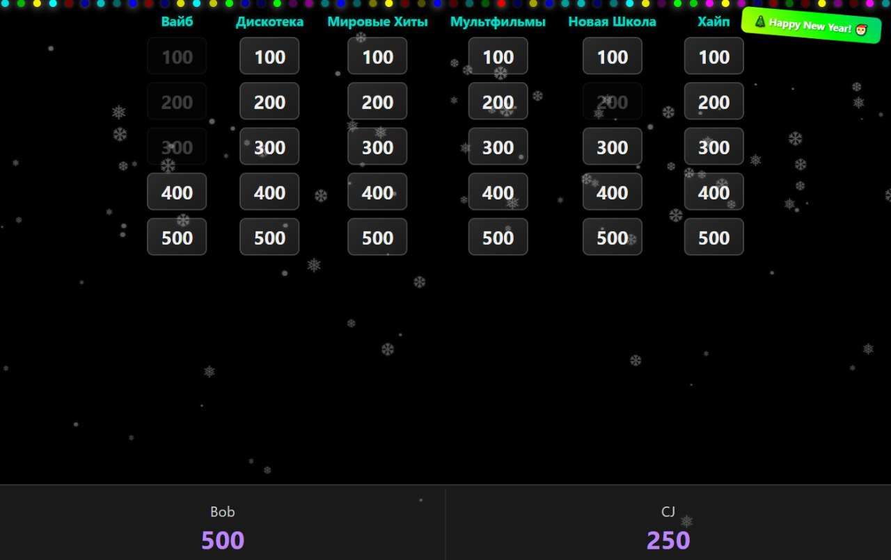
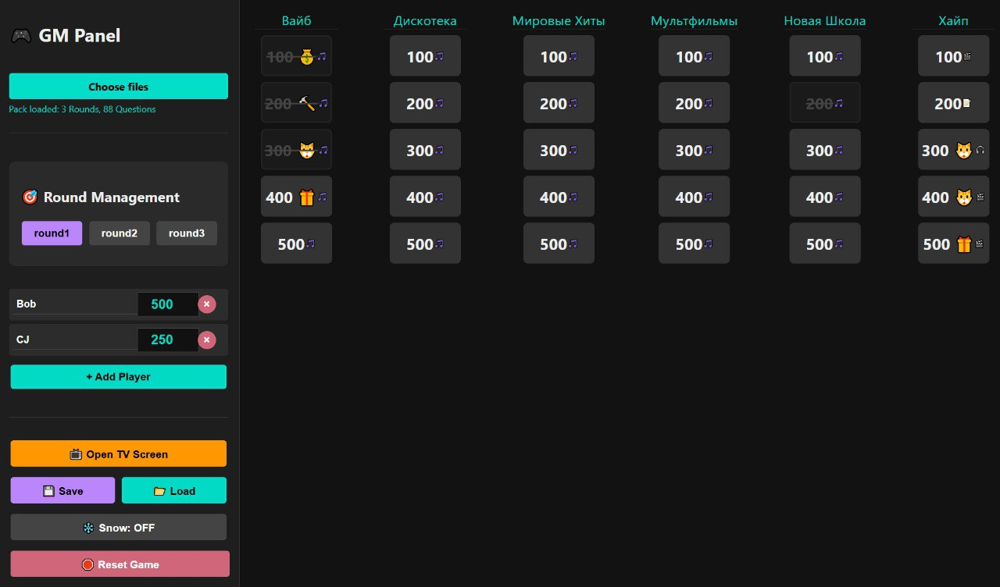
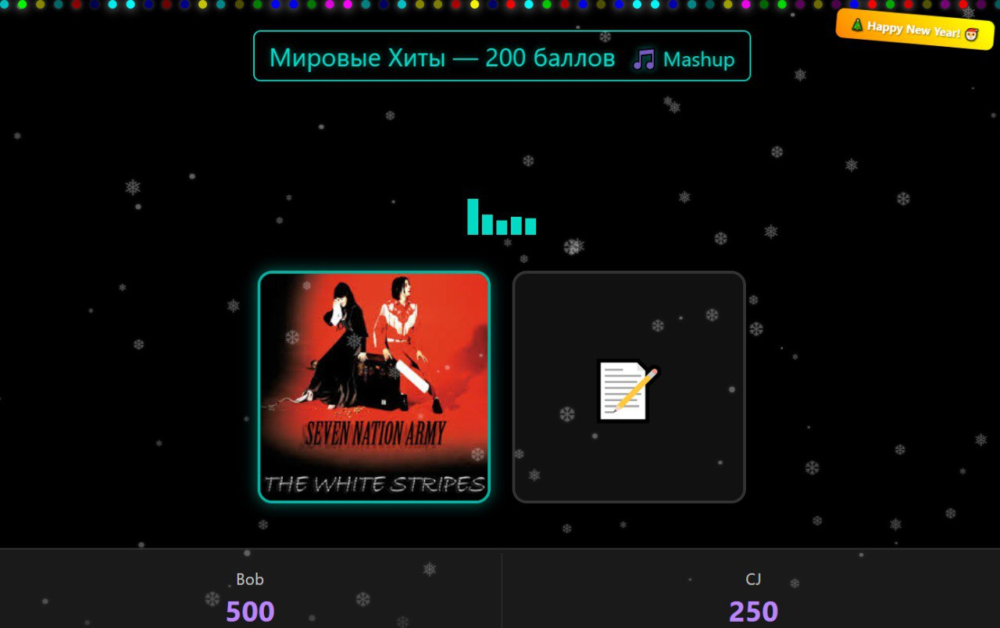
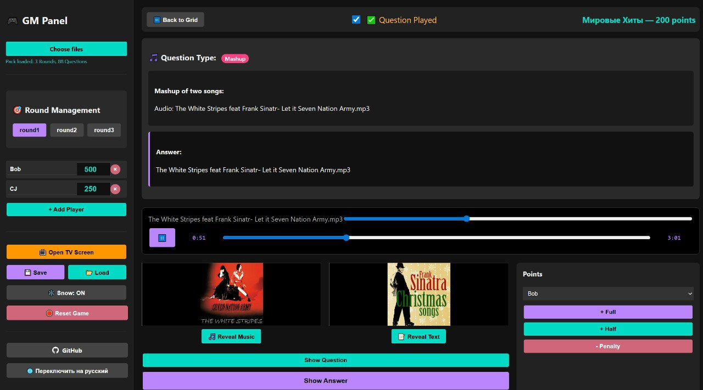

<div align="right">
  <p>
    <strong>English</strong> | <a href="README.ru.md">Русский</a>
  </p>
</div>

# Web selfhosted SIGame for offline parties

**Full vibe-coded project** for hosting local quiz games in the "SIGame" format (similar to "What? Where? When?").

This project was created **for fun** to host your own game in offline mode, where participants interact with the host directly, without using mobile devices or apps. Participants only need to be present in the room, and the host needs two screens: one with the admin panel for managing the game, and the second for displaying questions and information to players.

## How to Play

### Quick Start

1. **Download the game:**
   - Go to [Releases](https://github.com/donebd/SIGame/releases) and download the latest `SIGame.html` file
   - Or build it yourself (see [Building](#building) section)

2. **Open the game:**
   - Double-click `SIGame.html` to open it in your browser - this will be the admin panel for the host

3. **Open the TV screen for players:**
   - Click the "Open TV Screen" button in the admin panel
   - Or open `SIGame.html?screen=game` in a new browser window/tab
   - This window should be displayed on a second screen/projector so players can see the questions

4. **Set up the game:**
   - Load a question pack folder (see folder structure below)
   - Add players/teams through the admin panel
   - Start the game by selecting questions from the grid

### Recommended Setup

- **Screen 1 (Admin Panel):** Host's laptop/computer - here the host manages the game
- **Screen 2 (TV Screen):** Projector/large monitor for players - here players see questions and scores

**Important:** Both screens should be open in the same browser (can be on different devices on the same network, but BroadcastChannel API only works within the same browser/profile). For cross-device operation, additional synchronization setup will be required.

## Screenshots

### Game Grid View
**Left:** Players View | **Right:** Admin View

<p align="center">
  
  
</p>

### Question View & Controls
**Left:** Players View | **Right:** Admin View

<p align="center">
  
  
</p>

## How It Works

**The Host** manages the game through the admin panel:
- Loads question packs
- Adds players/teams
- Selects questions from the grid
- Controls content display (shows questions, answers, media)
- Awards/deducts points
- Controls audio and video playback

**Players** see on the large screen (TV screen):
- Question grid
- Current question with media content
- Player/team scores
- Animations and visual effects

All synchronization between the admin panel and player screen happens automatically via BroadcastChannel API in real-time.

## Features

- 🎮 Admin panel for game management
- 📺 Player screen with real-time synchronization
- 🎵 Support for various question types (mashup, audio, video, text)
- 🖼️ Support for media in questions and answers (images, video, audio)
- 💾 Automatic game state saving
- 🔄 Synchronization between admin panel and player screen
- ❄️ Holiday effects (snow, garlands)
- 🎉 Confetti animations
- 🎯 Special cards (cat in a bag, bet, auction)

## Project Structure

```
src/
├── types/           # TypeScript types and interfaces
├── state/           # State management
├── services/        # Business logic services
│   ├── StorageService.ts
│   ├── SyncService.ts
│   └── FileService.ts
├── ui/              # UI components
│   ├── BaseUI.ts
│   ├── AdminUI.ts
│   └── TVScreen.ts
├── media/           # Media controllers
│   ├── AudioController.ts
│   └── VideoController.ts
├── utils/           # Utility functions
│   ├── helpers.ts
│   ├── fileDetector.ts
│   └── i18n.ts
├── app.ts           # Main application entry point
└── styles.css       # Application styles
```

## Installation

```bash
npm install
```

## Development

```bash
# Development mode with hot reload
npm run dev

# Build for production
npm run build

# Type checking
npm run type-check

# Serve built files
npm run serve
```

## Building

The project uses Webpack to bundle everything into a single HTML file:

```bash
npm run build
```

The output will be in `SIGame.html` - a single, self-contained HTML file that can be opened in any browser.

## Creating Question Packs

### Folder Structure

```
root/
├── round1/
│   ├── Topic1 - 100/
│   │   ├── audio.mp3
│   │   ├── image1.jpg
│   │   └── image2.jpg
│   ├── Cat in a Bag - 200/
│   │   ├── special.txt
│   │   ├── audio.mp3
│   │   ├── question.txt
│   │   └── answer.txt
│   └── ...
└── round2/
    └── ...
```

**Important:** 
- Question folder name must contain the score in points (e.g., `Topic1 - 100`, `Cat in a Bag - 200`)
- Round name is the first-level folder name
- Category name is extracted from the question folder name (part before `-`)

### Question Types

#### 1. Mashup
**Definition:** Audio file + 2+ images, without `question.txt`

**File structure:**
```
Topic - 100/
├── audio.mp3 (or .wav, .ogg, .m4a)
├── image1.jpg (first image - music part of mashup)
└── image2.jpg (second image - text part of mashup)
```

**Features:**
- Players must guess two parts of the track
- Images gradually open (parts of the track)
- Answer (mashup name) is shown at the end

**Answer:** Specified in `answer.txt` or taken from audio file name

---

#### 2. Audio Question
**Definition:** Audio file + `question.txt` + `answer.txt`

**File structure:**
```
Topic - 100/
├── audio.mp3 (or .wav, .ogg, .m4a)
├── question.txt (question text)
└── answer.txt (answer text)
```

**Additional media (exact file names):**

**For questions:**
- `questionImage.jpg` (or `.png`, `.jpeg`, `.webp`) - image for question
- `questionVideo.mp4` (or `.webm`, `.avi`, `.mov`) - video for question
- `questionAudio.mp3` (or `.wav`, `.ogg`, `.m4a`) - additional audio for question

**For answers (hidden until "Show Answer" is pressed):**
- `answerImage.jpg` (or `.png`, `.jpeg`, `.webp`) - image for answer
- `answerVideo.mp4` (or `.webm`, `.avi`, `.mov`) - video for answer
- `answerAudio.mp3` (or `.wav`, `.ogg`, `.m4a`) - audio for answer

**⚠️ Important:** File names must be exactly as specified above (case matters). Extensions can differ within the specified formats.

**Example with media:**
```
Topic - 100/
├── audio.mp3
├── question.txt
├── questionImage.jpg (image for question)
├── answer.txt
└── answerVideo.mp4 (video with answer)
```

---

#### 3. Video Question
**Definition:** Video file + `question.txt` + `answer.txt`

**File structure:**
```
Topic - 100/
├── video.mp4 (or .webm, .avi, .mov)
├── question.txt (question text)
└── answer.txt (answer text)
```

**Additional media (exact file names):**

**For questions:**
- `questionImage.jpg` (or `.png`, `.jpeg`, `.webp`) - image for question
- `questionVideo.mp4` (or `.webm`, `.avi`, `.mov`) - additional video for question
- `questionAudio.mp3` (or `.wav`, `.ogg`, `.m4a`) - audio for question

**For answers:**
- `answerImage.jpg` (or `.png`, `.jpeg`, `.webp`) - image for answer
- `answerVideo.mp4` (or `.webm`, `.avi`, `.mov`) - video for answer
- `answerAudio.mp3` (or `.wav`, `.ogg`, `.m4a`) - audio for answer

**⚠️ Important:** File names must be exactly as specified above (case matters). Extensions can differ within the specified formats.

**Example with media:**
```
Topic - 100/
├── video.mp4
├── question.txt
├── answer.txt
└── answerImage.jpg (image with answer)
```

---

#### 4. Text Question
**Definition:** `question.txt` + `answer.txt`, without audio/video files

**File structure:**
```
Topic - 100/
├── question.txt (question text)
└── answer.txt (answer text)
```

**Additional media (exact file names):**

**For questions:**
- `questionImage.jpg` (or `.png`, `.jpeg`, `.webp`) - image for question (recommended!)
- `questionVideo.mp4` (or `.webm`, `.avi`, `.mov`) - video for question
- `questionAudio.mp3` (or `.wav`, `.ogg`, `.m4a`) - audio for question

**For answers:**
- `answerImage.jpg` (or `.png`, `.jpeg`, `.webp`) - image for answer
- `answerVideo.mp4` (or `.webm`, `.avi`, `.mov`) - video for answer
- `answerAudio.mp3` (or `.wav`, `.ogg`, `.m4a`) - audio for answer

**⚠️ Important:** File names must be exactly as specified above (case matters). Extensions can differ within the specified formats.

**Example with media:**
```
Topic - 100/
├── question.txt
├── questionImage.jpg (image for question)
├── answer.txt
└── answerImage.jpg (image with answer)
```

---

### Special Cards

Create a `special.txt` file in the question folder to create a special card.

**`special.txt` format:**
```
cat
Special card description
Can be multiple lines
```

**Special card types:**
- `cat` - Cat in a Bag
- `bet` - Bet
- `auction` - Auction
- `special` - Special

**Example:**
```
Cat in a Bag - 300/
├── special.txt
├── audio.mp3
├── question.txt
└── answer.txt
```

**`special.txt` content:**
```
cat
This question can be passed to another team (description of what you want to show players on the cat in a bag screen)
```

---

### Media in Answers

**Important:** For all question types (audio, video, text), you can add media to answers. **Answer media is hidden on the player screen until the "Show Answer" button is pressed in the admin panel.**

**Display priority:** Image > Video > Audio

---

### Complete Example Pack Structure

> 📦 **Example pack:** [Example Question Pack](https://github.com/donebd/SIGame/tree/main/pack-examples/readme-pack-example) - a ready-made example pack structure with various question types and special cards.

```
MyGamePack/
├── Round 1 - Music/
│   ├── Pop - 100/                    # Audio question
│   │   ├── audio.mp3
│   │   ├── question.txt
│   │   ├── questionImage.jpg
│   │   ├── answer.txt
│   │   └── answerImage.jpg          
│   │
│   ├── Pop - 200/                    # Mashup question
│   │   ├── audio.mp3
│   │   ├── image1.jpg                # First image (music)
│   │   ├── image2.jpg                # Second image (text)
│   │   └── answer.txt
│   │
│   ├── Pop - 300/                    # Audio question with video in answer
│   │   ├── audio.mp3
│   │   ├── question.txt
│   │   ├── answer.txt
│   │   └── answerVideo.mp4          
│   │
│   ├── Pop - 400/                    # Audio question with audio in answer
│   │   ├── audio.mp3
│   │   ├── question.txt
│   │   ├── answer.txt
│   │   └── answerAudio.mp3          
│   │
│   ├── Pop - 500/                   
│   ├── Rock - 100/
│   ├── Rock - 200/
│   ├── Rock - 300/                    # Cat in a Bag (special: cat)
│   │   ├── special.txt               # Contains: "cat\nDescription of cat in a bag round"
│   │   ├── audio.mp3
│   │   ├── question.txt
│   │   └── answer.txt
│   ├── Rock - 400/
│   └── Rock - 500/
├── Round 2 - Video/
│   ├── Movies - 100/                 # Simple Video question
│   │   ├── video.mp4
│   │   ├── question.txt
│   │   └── answer.txt
│   │
│   ├── Movies - 200/                 # Video question with media
│   │   ├── video.mp4
│   │   ├── question.txt
│   │   ├── questionImage.jpg
│   │   ├── answer.txt
│   │   └── answerVideo.mp4
│   ├── Movies - 300/                 
│   ├── Movies - 400/
│   ├── Movies - 500/
│   │
│   ├── TV Shows - 100/
│   │
│   ...
│   └── TV Shows - 500/
│
└── Round 3 - Text/
    ├── History - 100/                # Simple Text question
    │   ├── question.txt
    │   └── answer.txt
    │
    ├── History - 200/                # Text question with image
    │   ├── question.txt
    │   ├── questionImage.jpg         # Image in question
    │   ├── answer.txt
    │   └── answerImage.jpg           # Image in answer
    ....
```

**Folder structure:**
   - Round name = first-level folder (`Round 1 - Music`)
   - Category name = part of question folder name before `-` (`Pop`, `Rock`, `History`)
   - Score = number after `-` (`100`, `200`, `300`, `400`, `500`)

---

### Recommendations

**File sizes:**
   - Try to optimize media files for fast loading
   - Recommended image size: up to 2MB
   - Recommended video size: up to 50MB

**Text files:**
   - Use UTF-8 encoding
   - Line breaks are supported
   - HTML tags can be used (carefully!)

## License

MIT

Full license text is available in the [LICENSE](https://github.com/donebd/SIGame/blob/main/LICENSE) file.

## Contributing

Contributions are welcome! Please feel free to submit a Pull Request.
